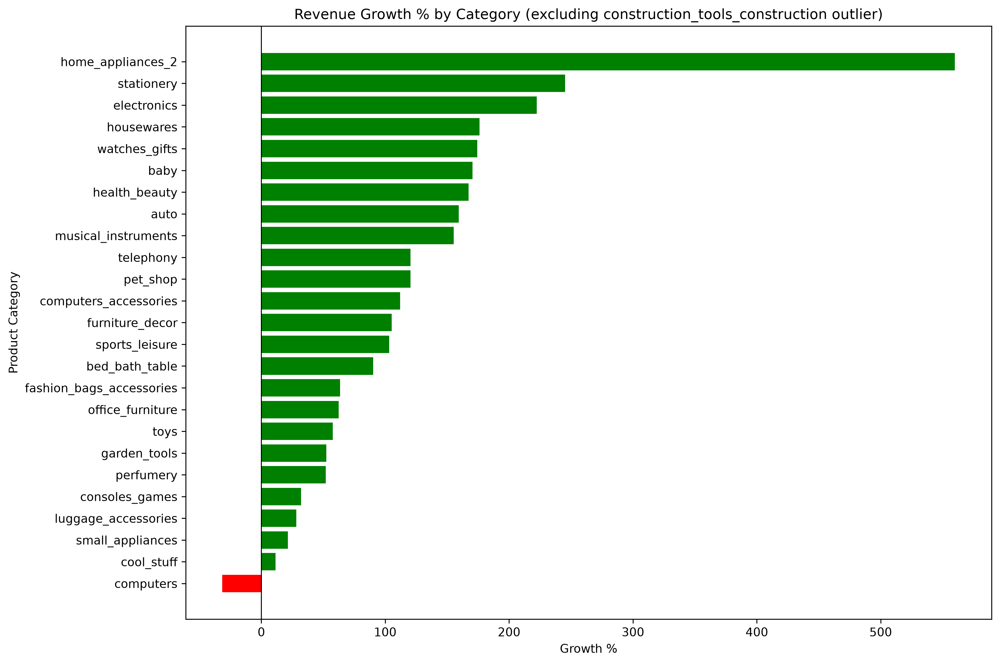

# E-commerce Revenue Analysis — Olist Store

Diagnosed a category-specific revenue decline in a multi-category e-commerce dataset using SQL and Python, tracing the root cause to seller behavior rather than customer demand.

## 🛠️ Tools Used
- **PostgreSQL** — built a relational database from 4 tables, wrote analytical queries (multi-table JOINs, CTEs, conditional aggregation, period-over-period comparisons)
- **Python (pandas, matplotlib)** — read SQL output and built the final visualization

## 📊 Dataset
[Brazilian E-Commerce Public Dataset by Olist](https://www.kaggle.com/datasets/olistbr/brazilian-ecommerce) — real, open-source data from a Brazilian e-commerce platform, ~99,000 orders across 4 tables (orders, order items, products, category translation).

## ❓ Business Problem
Management (a realistic scenario built on real data) reported a revenue decline in "some product categories." The goal: determine whether the decline was real, which category was affected, and the root cause.

## 🔍 Methodology
1. Identified the reliable time window in the data (excluded incomplete first/last months)
2. Filtered to `delivered` orders only, documenting the small share of revenue excluded for missing category mapping (1.4%)
3. Applied a materiality threshold to exclude small categories from growth-rate comparisons
4. Compared each category's revenue across two roughly equal time periods
5. For the one declining category, drilled down to individual product level to isolate the root cause (price change vs. catalog composition change)

## 💡 Key Findings
- **No broad decline**: 25 of 26 qualifying categories grew strongly during the study period
- **The one exception**: the `computers` category declined 31.5% — order count did not drop (in fact rose slightly: 97 → 102), so the decline was purely price-driven
- **The root cause**: product-level analysis showed the same individual products held or slightly increased their price — the average dropped because sellers of high-priced products stopped listing, not because any product actually got cheaper
- Overall order cancellation rate was negligible (0.58%) and does not explain the pattern

## 📈 Visualization

*Growth/decline percentage by category, with the `computers` category highlighted in red against a field of growing (green) categories.*

## 🎯 Business Recommendation
Investigate the status of sellers who previously listed high-priced computer products — did they leave the platform, or run out of stock? This is a **seller retention** question, not a pricing or marketing question.

## ⚠️ Data Limitations
- The source has no explicit "return" field; the cancellation rate was used only as a rough proxy
- The "sellers stopped listing" explanation is the better-evidenced of two possible explanations, not a certainty — direct seller activity data would be needed to confirm it fully
- A spelling inconsistency in the source data splits what should be one category into two (`construction_tools_*` and `costruction_tools_*`)

## 📂 Repository Structure
```
├── data/           # CSV files exported from SQL
├── notebooks/      # Jupyter Notebook (Python/pandas/matplotlib)
├── sql/            # Core SQL analysis queries
└── reports/        # Full write-up and chart
```
